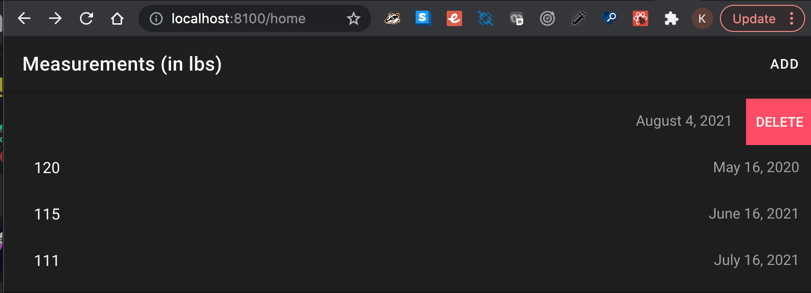
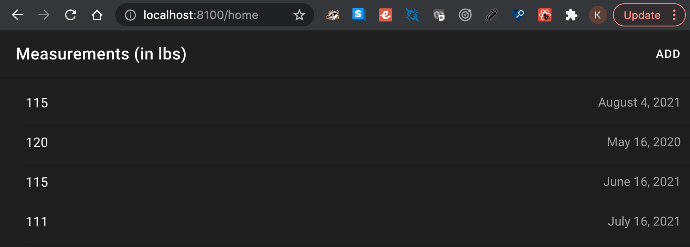

# Weight Tracker Mobile App Using Ionic

In this project, I created a simple application that tracks the weight over time, and will store the record. The application will have a list of weight measurements, and dates assigned to them.

The application will allow users to have enter a new measurement linked to today's date and users will also be able to remove entries from the list. 

